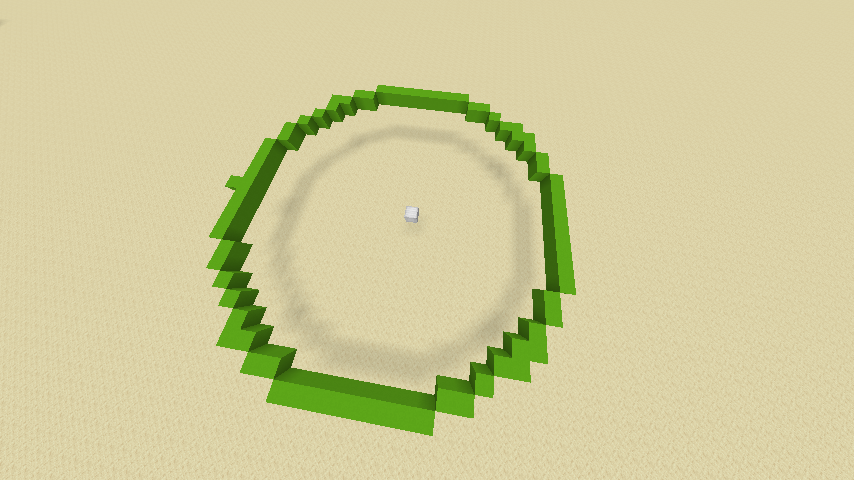
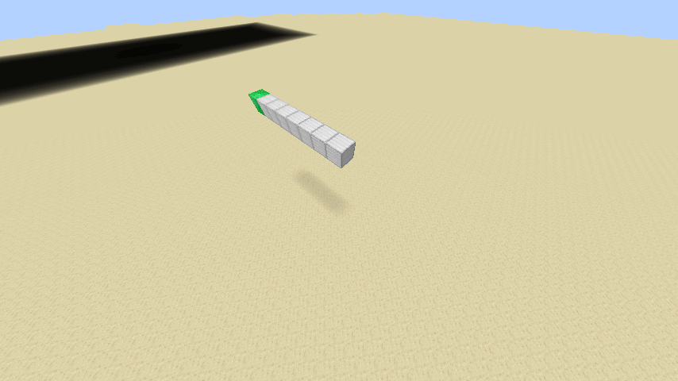
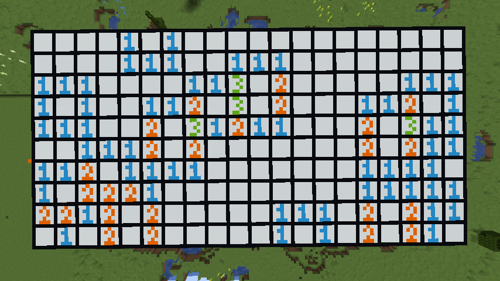

# BOOM EXTENSION for MCJE 1.16.5 !!

この拡張機能は主にcircle.py、creeper_ex.py、mcje_sweeperを追加します。
## circle.py

setCircleというAPIを追加します。引数に半径、円の中心の座標を入れることができ、numpyのsin、cos関数を用いることでマイクラ空間に円形にブロックを配置することができます。最初期に作成したプログラムなので問題点は山積みですが、ギリギリ利用できるように調整し改善点を残しています(めんどくさいわけではない)。改良してみてはいかかでしょうか?(決して丸投げではない)

## creeper_ex.py

creeper_set、creeper_turnというAPIを追加します。かなり最近まで取り組んでいたのである程度最適化されています。creeper_setではgifのようなアルゴリズムでクリーパーの顔を生成しています。最初にエメラルドブロックの座標を指定してそこからx,y,zの任意の軸を指定してプラスかマイナスの方向を決めます。次に二つ目の軸を選ぶのですが、こちらはプログラムの簡略化のためマイナス方向に限られます。面ができたら最初に代入する、画像中の金ブロックにあたる座標に対して立体にしていきます。この中心の座標はget_coreという関数で得られるのでさほど難しくはありません。最後に先の面に上から顔を書いていく事で完成します。かなり複雑ですがこれらは顔のfont変更、顔をつける面を指定できるようにしたためです。最低限の引数でも動くようにはなっているので場合に応じて引数を変えてもらえればOKです。creeper_turnはこの複雑機能の応用で、顔の面がくるくると入れ替わるアニメーションです。

## mcje_sweeper.py
このプログラムは[これだよ!](https://daeudaeu.com/minesweeper/)を参考に、マインクラフト上でマインスイーパーができるように改造したものになります。マインクラフト上での操作はconvert_mcje.pyのほうが主に行い、それを条件に従って幾一呼び出すという仕組みです。マインスイーパーという一つのゲームである以上、すべてを説明するのは難しいですが、これまで作ってきたAPIを盛り込んだ作品だと思っていただければ大丈夫です。テストプレイは少ないのでバグを発見された際はissueなどで教えていただけたら幸いです。
....実はチートが隠されているのでコードを読んでやってみても楽しいかもしれません(難読化されていないのですぐ見つかります!!)。

